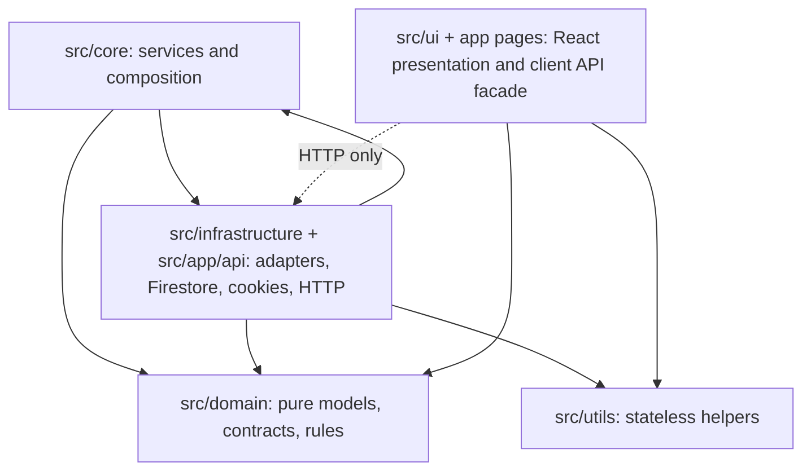

# WoodBine Knowledge Ledger

Definitive architectural bridge for humans and autonomous agents working in the DreamBees Art repository.

## Navigation

### Onboarding
- [Getting Started](./onboarding/getting-started.md) — environment requirements, install, first run, verification commands.
- [Walkthrough](./onboarding/walkthrough.md) — guided tour through Domain, Core, Infrastructure, UI, and Plumbing.
- [Day 2 Operations](./onboarding/day-2.md) — extending the engine, building features, and maintenance.
- [Troubleshooting](./onboarding/troubleshooting.md) — verified operational pitfalls and recovery commands.

### Architecture
- [Overview](./architecture/overview.md) — Joy-Zoning dependency graph, request/session flow, and structural rationale.
- [Project State](./architecture/project-state.md) — concrete snapshot of implemented storefront, admin, Core, Infrastructure, tests, and benchmark surfaces.
- [Directories](./architecture/directories.md) — top-level directory dictionary with constraints.
- [Schemas](./architecture/schemas.md) — domain models, repository contracts, service interfaces, API guard behavior.
- [Decisions](./architecture/decisions.md) — ADRs protecting architectural intent.
- [Risk Map](./architecture/risk-map.md) — fragile surfaces, blast radius, and mandatory tests.
- [Order Flow Throughput](./architecture/order-flow-throughput.md) — concrete cart, checkout, and full order-flow concurrency benchmark results.
- [Admin Panel](./architecture/admin-panel.md) — features, merchant operations, and technical implementation.
- [Product Management & Intake Metadata](./architecture/product-management.md) — SKU, supplier/manufacturer metadata, product category handling, and Firestore/API/admin form behavior.
- [Support CRM](./architecture/support-crm.md) — Professional ticketing system, agent collision, macros, and knowledgebase routing.
- [Digital Fulfillment](./architecture/digital-fulfillment.md) — Streaming-first ingestion, digital locker, and secure asset delivery.
- [SEO & Navigation](./architecture/seo-routing.md) — Canonical handles, JSON-LD, and crawler optimization.
- [Concierge & Support Operations](./architecture/concierge-system.md) — Intelligent support workspace, outcome tracking, and operational digests.
- [Concierge Lifecycle Marketing & Campaign Automation](./architecture/lifecycle-marketing-concierge.md) — Autonomous recapture playbooks, lifecycle strategy, customer investigation, and campaign governance.
- [Admin Access](./admin-access.md) — credentials and instructions for local access.

### Ledger
- [Changelog](./changelog.md) — granular forensic citations for verified structural changes.

### Long-Form Docs
- [Documentation Index](../docs/index.md) — long-form technical documents outside the wiki ledger.
- [Brief](../docs/brief.md) — executive summary.
- [Philosophy](../docs/philosophy.md) — design principles and architectural mindset.
- [Whitepaper](../docs/whitepaper.md) — full technical thesis, reliability model, and verification architecture.

## Current Verified State

- **Transactional Hardening Verified**: Finalized production-grade transactional atomicity for the commerce engine. Implemented atomic discount usage decrements during cancellations and refunds. Transitioned all critical inventory and order logic to strict transactional point-reads (`t.get`).
- **Idempotency Hardening Verified**: Strengthened distributed order creation via a dedicated idempotency mapping collection and atomic payment-intent tracking in `OrderService`.
- **Refund Orchestration Verified**: `RefundService` now includes direct `discountRepo` injection, ensuring ACID-compliant integrity across all lifecycle state transitions.
- **Support CRM Industrialization Verified**: Full-stack ticketing system implemented with `AdminTicketDetail.tsx` and `AdminTickets.tsx`. Real-time agent collision (heartbeat) prevents response overlap. Quick Reply macros and internal notes are fully functional.
- **Digital Fulfillment Pipeline Verified**: Memory-efficient, streaming-first ingestion architecture deployed. Digital Locker UI implemented in `DigitalLibraryPage.tsx` for secure, authenticated asset access.
- **SEO & Navigation Hardening Verified**: Canonical handle-based routing active for `/products/[handle]` and `/collections/[slug]`. Automated `sitemap.ts` and `robots.ts` orchestration implemented. JSON-LD structured data injected.
- **Concierge & Operational Intelligence Verified**: Production-grade support desk with triage intelligence and outcome tracking. Automated "Operational Digest" generates natural-language business insights. Team collaboration (assignment, activity feed) and customer continuity (session syncing) are fully functional and ground-truth verified.
- **Concierge Lifecycle Marketing Verified**: Autonomous lifecycle campaign strategy documented for welcome, cart recovery, browse assist, post-purchase care, review/referral, replenishment, win-back, VIP loyalty, and sunset suppression. Concierge tools now support customer investigation, lifecycle planning, playbook drafting, activation, optimization, enrollment, and suppression governance.
- **Order Flow Benchmark Documented**: Core cart, checkout reservation, and full order/payment/finalization throughput is documented with raw benchmark output and a reproducible `npm run benchmark:order-flow` script.
- **Framework/Runtime Stack**: Next.js `15.5.18`, React `18.3.1`, TypeScript `~6.0.2`, ESLint `10.2.1`, Tailwind CSS `4.2.4`.
- **Persistence Layer**: Google Cloud Firestore (Distributed NoSQL).
- **Security Configuration**: Signed HTTP-only session cookies with HMAC-SHA256 signatures and production `SESSION_SECRET` length enforcement.
- **API Boundary Hardening**: Lightweight mutation throttling (rate-limiting) implemented in `apiGuards.ts`. Mutation-origin policy enforces same-origin for `POST/PUT/DELETE` requests.

## Physical Verification Commands

Run these from the repository root:

```bash
npm run lint
npm run build
npm run test
npm run test:storefront-release   # frozen storefront proof suite
npm run test:e2e:cart-smoke       # isolated cart-to-checkout journey
npm run test:e2e:checkout-smoke   # isolated checkout journey
npm run test:e2e                  # full Playwright suite
```

Storefront release gate: [docs/storefront-release.md](../docs/storefront-release.md). Cart contract: [docs/cart.md](../docs/cart.md). The isolated browser gates validate guest/auth cart transitions and checkout without live Stripe or Firestore.

## Mermaid: Architectural Bridge


