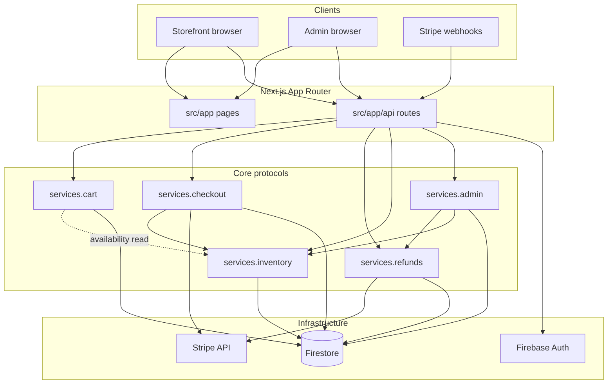
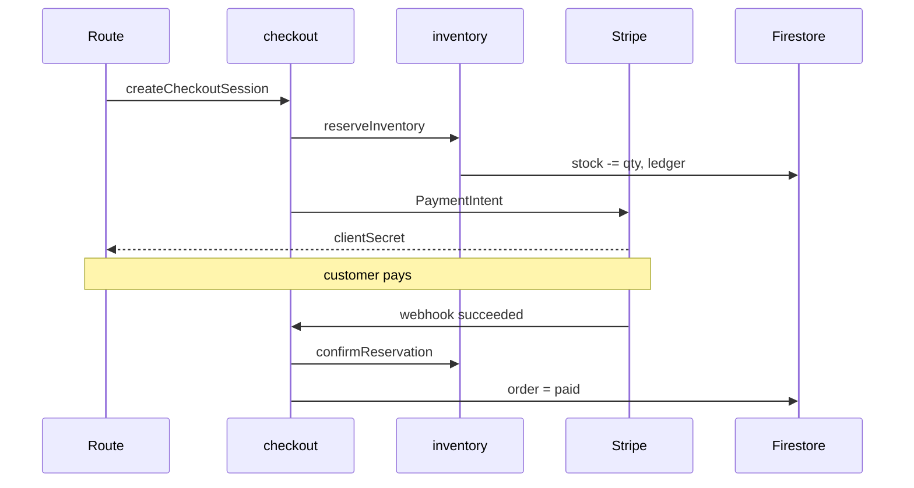
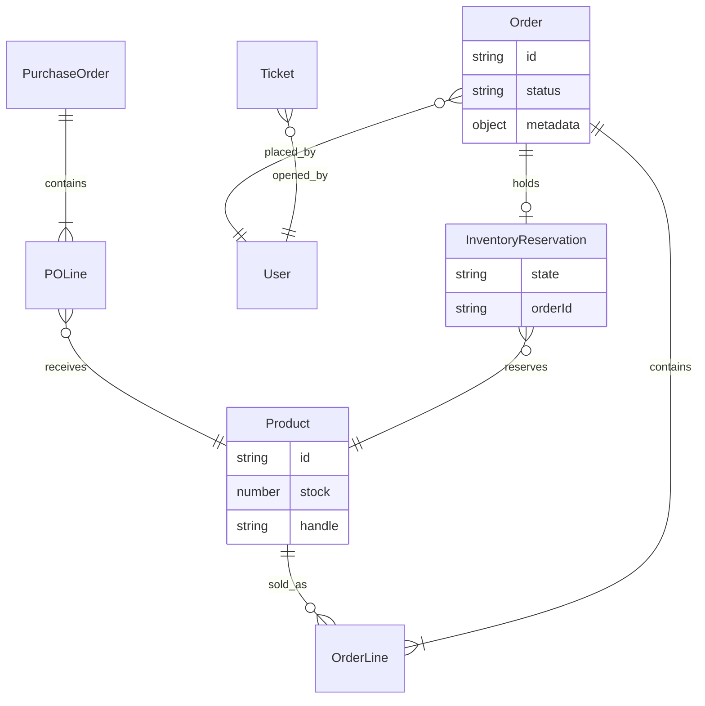

# Architecture

MeowAcc is a **layered TypeScript monolith**: one Next.js deployable containing storefront, admin, API routes, and commerce orchestration. The design mirrors Shopify’s familiar surfaces while keeping **explicit protocol boundaries** for money and stock — because self-hosted checkout must be recoverable, auditable, and testable in source.

**New here?** Read [onboarding.md](./onboarding.md) first, then [flows.md](./flows.md) for end-to-end stories.

---

## System context



---

## Layer model

| Layer | Path | Responsibility | Constraints |
| --- | --- | --- | --- |
| **Domain** | `src/domain/` | Models, repository interfaces, pure rules, validation, calculations, typed errors | No I/O. No Next.js, Firestore, fetch, or cookies. |
| **Core** | `src/core/` | Application services, workflow orchestration, commerce protocols | No HTTP. Delegates to injected adapters. |
| **Infrastructure** | `src/infrastructure/` | Firestore repos, Firebase/Stripe/Brevo adapters, session, guards | Implements Domain contracts; maps transport ↔ Core. |
| **App Router** | `src/app/` | Pages and `route.ts` handlers | Thin: parse, guard, delegate to `services.*`, map results. |
| **UI** | `src/ui/` | React pages and components | Calls APIs via `apiClientServices.ts`; no direct Infra. |
| **Utils** | `src/utils/` | Formatters, logging, SEO helpers | Stateless. |

**Dependency rule:** UI → API → Core → Domain ← Infrastructure. Domain never imports outward.

---

## Commerce protocols (the cages)

Four mutation boundaries are **frozen**. Cart is an additional purchase-intent boundary: it may read availability but cannot mutate money or stock. Full policy: [commerce-protocol-frozen.md](./commerce-protocol-frozen.md). Cart detail: [cart.md](./cart.md).

```txt
checkout  = money capture      → CheckoutApplicationService
refunds   = money reversal     → RefundApplicationService
inventory = stock movement     → InventoryApplicationService
admin     = human authority    → AdminApplicationService
cart      = purchase intent    → CartApplicationService
```

```txt
No route, tool, admin action, or automation touches raw money mutation services directly.
```

| Boundary | Container key | Internal engine (do not import from routes) |
| --- | --- | --- |
| Checkout | `services.checkout` | `CheckoutMutationService`, `StripeService` |
| Cart | `services.cart` | `CartFlowService`, `InventoryAvailabilityReader` |
| Refunds | `services.refunds` | `RefundService` |
| Inventory | `services.inventory` | `InventoryMutationService` → `batchUpdateStock` |
| Admin | `services.admin` | Delegates to above + `OrderService` (authorized) |

Each boundary returns `*Result<T>` — expected failures are data, not thrown exceptions.

---

## Service container

All server wiring flows through `src/core/container.ts`:

```text
getInitialServices() / getServerServices()
  ├── checkout, refunds, inventory, admin    ← mutation boundaries
  ├── cart                                ← purchase-intent protocol
  ├── orderService, productService        ← orchestration / reads
  ├── fulfillmentService, orderQueryService   ← fulfillment & queries
  └── refundService                           ← INTERNAL (RefundFlowService only)
```

| Protocol | Factory | Implementation |
| --- | --- | --- |
| Checkout | `createCheckoutStack()` / `wireOrderCheckoutStack()` | `CheckoutFlowService` |
| Cart | `createCartStack()` / `wireCartStack()` | `CartFlowService` |
| Refunds | `createRefundStack()` | `RefundFlowService` |
| Inventory | `createInventoryStack()` | `InventoryFlowService` |
| Admin | `createAdminStack()` | `AdminFlowService` |

---

## Read path vs write path

Not every API call goes through the four protocols. Use this table when adding routes:

| Operation | Correct entry | Example |
| --- | --- | --- |
| Add/update cart intent | `services.cart` | `/api/cart/items` |
| Start checkout | `services.checkout` | `createCheckoutSession` |
| Stripe webhook | `services.checkout` | `handleCheckoutWebhook` |
| Refund | `services.admin.requestRefund` → `services.refunds` | Admin UI |
| Concierge refund | `services.refunds.createRefund` | Chat tool |
| Adjust stock | `services.admin` → `services.inventory` | Batch adjust |
| PO receive | `services.admin` → PO service → `receiveStockAtLocation` | Receiving UI |
| List orders (customer) | `orderQueryService` / read repos | `GET /api/orders` |
| Product detail (storefront) | `productService` / repos | `GET /api/products/[id]` |
| Fulfill order | `services.admin.fulfillOrder` | Admin order page |

**Rule of thumb:** If it moves money or catalog stock, it goes through a protocol. If it only reads or sends email, it uses the appropriate read/orchestration service.

---

## Cross-protocol purchase sequence

The most important integration in the codebase:



Full narrative: [flows.md § Purchase flow](./flows.md#purchase-flow-storefront-checkout)

---

## Request lifecycle

Every mutation route should follow this shape:

```text
1. HTTP request     → src/app/api/.../route.ts
2. Guards           → session, role, rate limit, same-origin (apiGuards.ts)
3. Parse + validate → domain-aligned parsers
4. Delegate         → services.{cart|checkout|refunds|inventory|admin}.*
5. Adapt result     → *RouteAdapter → JSON + HTTP status
6. Audit (optional) → AuditService / operator event log
```

Forensic correlation fields logged at protocol boundaries: `orderId`, `caseId`, `stripeEventId`, `idempotencyKey`.

---

## Persistence model

Runtime commerce data lives in **Firestore** (`src/infrastructure/repositories/firestore/`).

| Concern | Representative data | Idempotency stores |
| --- | --- | --- |
| Catalog | products, collections, taxonomy | — |
| Cart & orders | carts, orders, checkout attempts | checkout attempt keys |
| Payments | Stripe metadata on orders | `stripe_webhook_events` |
| Inventory | levels, reservations, ledger | ledger markers per operation |
| Refunds | order refund metadata | `refund_execution_claims` |
| Admin ops | audit, operator events | `operator_action_events` |
| Support | tickets, knowledgebase | — |

Checkout and refund protocols use **separate claim collections** so duplicate webhooks and retries never double-apply.

---

## Core entities (conceptual)

How major records relate — not an exhaustive schema:



| Entity | Primary store | Owned by |
| --- | --- | --- |
| Product | Firestore `products` | Catalog / ProductService reads; stock via inventory protocol |
| Order | Firestore `orders` | Checkout creates; admin fulfills |
| Reservation | Firestore reservations | Inventory protocol |
| Ledger entry | Firestore ledger | Inventory protocol (append-only) |
| Refund event | `refund_execution_events` | Refund protocol |
| Checkout claim | `stripe_webhook_events` | Checkout protocol |

Schema detail: [.wiki/architecture/schemas.md](../.wiki/architecture/schemas.md)

---

## Extension guide (summary)

Full checklist: [contributing-commerce.md](./contributing-commerce.md)

```text
Money?     → checkout or refunds
Stock?     → inventory (admin wraps with authorization)
Operator?  → admin
Read-only? → query services / repos
```

---

## Security model

| Mechanism | Location | Purpose |
| --- | --- | --- |
| Signed session cookie | `session.ts` | Customer and admin identity |
| Admin guards | `apiGuards.ts`, admin layouts | Role + route protection |
| Elevation | `AdminFlowService` | Refunds, sensitive batch ops |
| Same-origin mutations | `assertTrustedMutationOrigin` | CSRF mitigation |
| Rate limits | Route guards | Abuse protection |
| Checkout lock | Checkout protocol | One active checkout per user |
| Idempotency keys | All mutation protocols | Safe retries |

---

## Directory map for contributors

| I want to… | Open |
| --- | --- |
| Understand entity shapes | `src/domain/models.ts` |
| Wire a new service | `src/core/container.ts` |
| Change cart behavior | `src/core/cart/cartFlowService.ts` |
| Change checkout behavior | `src/core/order/CheckoutFlowService.ts` |
| Change stock behavior | `src/core/inventory/InventoryFlowService.ts` |
| Change refund behavior | `src/core/refund/RefundFlowService.ts` |
| Change admin authorization | `src/core/admin/AdminFlowService.ts` |
| Add an API route | `src/app/api/…` (thin delegate only) |
| Change storefront UI | `src/ui/pages/` |
| Change admin UI | `src/ui/pages/admin/` |
| Map HTTP errors | `src/infrastructure/server/*RouteAdapter.ts` |
| Firestore adapter | `src/infrastructure/repositories/firestore/` |

---

## Testing strategy

| Layer | Tooling | When to run |
| --- | --- | --- |
| Storefront frozen chain | `npm run test:storefront-release` | Cart, checkout, catalog, PDP changes |
| Protocol seals | `*-verification-ladder.test.ts` | After any protocol change |
| Flow modules | Unit tests + in-memory repos | During development |
| API routes | Route tests on critical paths | Webhook, checkout verify |
| Cart browser smoke | `npm run test:e2e:cart-smoke` | Cart UI, storage, merge, and handoff changes |
| Checkout browser smoke | `npm run test:e2e:checkout-smoke` | Checkout UI releases |
| Storefront journeys | Playwright `e2e/` | Broader UI regression |
| Throughput | `npm run benchmark:order-flow` | Performance regression |

Protocol changes **require** ladder test updates — that is the architecture enforcement mechanism.

```bash
npm run test:storefront-release

npm test -- --run \
  src/tests/checkout-verification-ladder.test.ts \
  src/tests/refund-verification-ladder.test.ts \
  src/tests/inventory-verification-ladder.test.ts \
  src/tests/admin-verification-ladder.test.ts
```

---

## Deep dives

| Topic | Document |
| --- | --- |
| End-to-end stories | [flows.md](./flows.md) |
| Purchase intent / cart | [cart.md](./cart.md) |
| Money capture | [checkout.md](./checkout.md) |
| Stock movement | [inventory.md](./inventory.md) |
| Money reversal | [refunds.md](./refunds.md) |
| Merchant console | [admin.md](./admin.md) |
| Frozen rules | [commerce-protocol-frozen.md](./commerce-protocol-frozen.md) |
| Storefront release proofs | [storefront-release.md](./storefront-release.md) |
| Local setup | [onboarding.md](./onboarding.md) |
