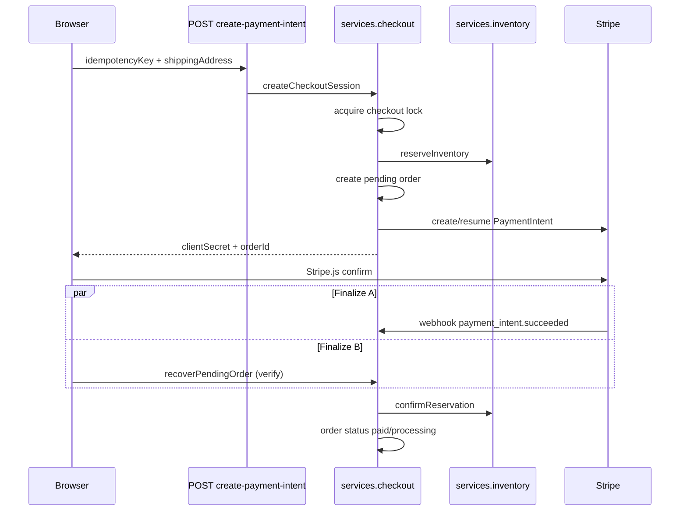

# Checkout

> **Checkout is an application protocol — not route spaghetti.**

MeowAcc checkout coordinates cart reservation, order creation, Stripe PaymentIntent lifecycle, payment finalization, rollback, reconciliation, operator recovery, and expired-order cleanup. It is the **money capture** boundary for this open-source ecommerce platform (Shopify Checkout analogue, fully inspectable in source).

The public boundary is frozen. Extend behavior inside `CheckoutFlowService` and flow modules — do not add parallel checkout entry points.

> **Cheat sheet:** [quick-reference.md](./quick-reference.md) · **Tests:** [testing.md](./testing.md)

Policy: [commerce-protocol-frozen.md](./commerce-protocol-frozen.md) · Platform context: [platform-overview.md](./platform-overview.md)

**Related:** [flows.md § Purchase flow](./flows.md#purchase-flow-storefront-checkout) · [inventory.md § Reservation lifecycle](./inventory.md#6-business-flows) · [onboarding.md § First purchase](./onboarding.md#first-purchase-walkthrough-what-actually-happens)

---

## Reading guide

| You want to… | Jump to |
| --- | --- |
| Understand the happy-path checkout | [End-to-end happy path](#end-to-end-happy-path) |
| See how inventory is reserved | [Checkout × inventory](#checkout--inventory) |
| Debug stuck pending orders | [When things go wrong](#when-things-go-wrong) |
| Look up a public method | [§3 Public API](#3-public-api) |
| Map routes to methods | [§5 Route inventory](#5-route-inventory) |
| Understand reconciliation | [§6 Business flows → Reconciliation](#6-business-flows) |
| Run proof tests | [§11 Verification](#11-verification) |

---

## Shopify analogue

| Shopify concept | MeowAcc implementation |
| --- | --- |
| Checkout | `CheckoutApplicationService` — PaymentIntent flow |
| Payments app / Stripe | `StripeService` internal to checkout stack only |
| Order creation | Pending order during session create; finalized on payment |
| Inventory reservation | `inventory.reserveInventory` during checkout |
| Webhooks | `POST /api/webhooks/stripe` → `handleCheckoutWebhook` |
| Abandoned checkout | Rollback + reservation release + cleanup job |
| Manual payment recovery | Reconciliation cases + operator `retry_recovery` |

Unlike Shopify’s hosted checkout, **you own the full state machine** in `src/core/order/`.

---

## End-to-end happy path



Both finalization paths are idempotent. Duplicate webhook delivery must not double-finalize.

---

## Checkout × inventory

Checkout never calls `batchUpdateStock`. It uses the narrow **mutation backend**:

| Checkout phase | Inventory call | Catalog stock |
| --- | --- | --- |
| Session create | `reserveInventory` | Decremented (hold) |
| Payment success | `confirmReservation` | Unchanged (already held) |
| Payment fail / abandon | `releaseReservation` | Restored |
| Expired pending (cleanup) | `releaseReservation` | Restored |

Reservations run inside Firestore transactions when checkout provides a `transaction` handle — catalog and order stay consistent.

Oversell during reserve opens a reconciliation case instead of silent double-sell. See [inventory.md](./inventory.md).

---

## When things go wrong

| Symptom | Likely cause | First look |
| --- | --- | --- |
| Order stuck **pending** after card charge | Webhook not received or verify not called | Stripe CLI forwarding, `STRIPE_WEBHOOK_SECRET` |
| Duplicate orders same cart | Missing client idempotency key | Client must send stable `idempotencyKey` |
| Paid in Stripe, pending locally | Finalization race / crash | Reconciliation case `paid_not_finalized` |
| Stock wrong after checkout | Bypassed inventory protocol | Never PATCH product `stock` |
| Cleanup returns HTTP 207 | Partial per-order failures | `CleanupExpiredPendingOrdersReport.errors[]` |
| Webhook 503 retry | Concurrent event claim | Stripe retries — expected |

Operator recovery: `POST /api/admin/reconciliation/cases` with `retry_recovery` (valid only for `paid_not_finalized`).

Narrative: [flows.md § Reconciliation](./flows.md#reconciliation-flow-payment-mismatch)

---

## 1. Protocol shape

Every checkout HTTP entry point follows the same stack:

```text
HTTP route
  → getServerServices().checkout          (CheckoutApplicationService)
  → CheckoutResult<T>                     (typed success or failure)
  → checkoutRouteAdapter                  (maps to HTTP status + JSON body)
  → structured logs                       (orderId, caseId, stripeEventId)
```

Internal orchestration (not imported by routes):

```text
CheckoutFlowService
  → flow modules (client start, webhook ingress, verify, cleanup, operator)
  → CheckoutMutationService               (CheckoutMutationBackend — internal only)
  → checkoutOrderResolver / checkoutPaymentIntentFlow / checkoutVerifyFlow
  → checkoutOrderState / checkoutEventLog
```

`OrderService` has **no checkout dependency**. It handles fulfillment, reads, and admin mutations. Checkout side effects (Stripe, cancel, operator recording) are injected when the stack is built in `container.ts` via `wireOrderCheckoutStack()`.

---

## 2. Construction

Single factory path — never wire `CheckoutMutationService` directly in routes or tests (use `createCheckoutStack()`).

```text
wireOrderCheckoutStack()
  → OrderService
  → createCheckoutStack({
       orderRepo, productRepo, cartRepo, discountRepo,
       audit, locker, shippingRepo,
       stripe,                    // single StripeService instance
       eventLog,                  // FirestoreCheckoutEventLog
       cancelExpiredPendingOrder, // OrderService.cancelExpiredPendingOrder
       recordOperatorAction,      // OrderService.handleReconciliationOperatorAction
     })
  → { orderService, checkout }
```

| Dependency | Source | Used for |
|------------|--------|----------|
| `stripe` | `container` singleton | PaymentIntent create/lookup, webhook ingress |
| `eventLog` | `FirestoreCheckoutEventLog` | Recovery + operator-action idempotency |
| `cancelExpiredPendingOrder` | `OrderService` admin path | Unpaid expired order cancellation during cleanup |
| `recordOperatorAction` | `OrderService` reconciliation admin | Operator case metadata before recovery |

---

## 3. Public API

**Interface:** `CheckoutApplicationService` (`src/core/order/checkoutApplicationService.ts`)  
**Implementation:** `CheckoutFlowService` (`src/core/order/CheckoutFlowService.ts`)  
**Container export:** `services.checkout`

Every public method returns `CheckoutResult<T>`. Expected failures never throw.

### Result contract

```ts
type CheckoutResult<T> =
  | { ok: true; data: T; duplicate?: boolean }
  | { ok: false; code: CheckoutErrorCode; message: string; retryable: boolean };
```

Helpers: `checkoutOk`, `checkoutErr`, `checkoutTry`, `checkoutFromError` in `src/core/order/checkoutResult.ts`.

### Methods

#### `createCheckoutSession`

Starts or resumes a Stripe PaymentIntent checkout for the storefront flow.

| | |
|---|---|
| **Route** | `POST /api/checkout/create-payment-intent` |
| **Input** | `userId`, `shippingAddress`, `idempotencyKey`, optional `userEmail`, `userName`, `discountCode`, `requireHighValueStepUp` |
| **Success data** | `{ clientSecret, paymentIntentId, orderId, amount, resumed? }` |
| **Typical errors** | `STRIPE_NOT_CONFIGURED`, `FORBIDDEN` (step-up), `SESSION_CREATE_FAILED`, `DOMAIN_ERROR`, `UNKNOWN` (retryable → 503) |

**Flow:** acquire checkout lock → reserve cart/inventory → create pending order → create or resume PaymentIntent → transition `checkoutOrderState` to `checkout_session_created`.

#### `recoverPendingOrder`

Success-page verification after Stripe redirect — confirms payment and finalizes the local order.

| | |
|---|---|
| **Route** | `POST /api/checkout/verify` |
| **Input** | `userId`, `paymentIntentId` |
| **Success data** | `{ success, orderId?, status?, message? }` |
| **Typical errors** | `VERIFICATION_FAILED`, `RECOVERY_FAILED`, `STRIPE_NOT_CONFIGURED` |

Stripe lookup is internal (injected `stripe` on the stack). Routes pass only the payment intent id.

#### `handleCheckoutWebhook`

Stripe webhook ingress — signature verification, event deduplication, payment confirmation or failure handling.

| | |
|---|---|
| **Route** | `POST /api/webhooks/stripe` |
| **Input** | `rawBody`, `signature` |
| **Success data** | `{ httpStatus, received, duplicate?, retry? }` |
| **Typical errors** | `WEBHOOK_INVALID_SIGNATURE`, `WEBHOOK_IN_PROGRESS` (503), `WEBHOOK_PROCESSING_FAILED`, `STRIPE_NOT_CONFIGURED` |

**Handled events:** `payment_intent.succeeded`, `payment_intent.payment_failed`. Other event types are logged and acknowledged.

Route is thin: delegates entirely to `services.checkout.handleCheckoutWebhook` and returns `data.httpStatus`.

#### `handleReconciliationOperatorAction`

Admin operator actions on reconciliation cases, including automated Stripe recovery retry.

| | |
|---|---|
| **Route** | `POST /api/admin/reconciliation/cases` |
| **Input** | `caseId`, `action`, `reason`, `actor` |
| **Success data** | `{ applied: true }` |
| **Typical errors** | `OPERATOR_NOT_CONFIGURED`, `OPERATOR_ACTION_FAILED` |

**Actions:** `mark_resolved`, `retry_recovery`, `initiate_refund_review`, `acknowledge_external`, `escalate`.

For `retry_recovery`: records operator action → runs Stripe recovery → marks resolved on success. Idempotent via `operator_action_events` and `checkout_recovery_attempts`. Duplicate calls return `{ ok: true, duplicate: true }`.

`recordOperatorAction` is stack-injected — routes never call `orderService` for mutations.

#### `cleanupExpiredPendingOrders`

System job: scan expired pending orders, finalize succeeded Stripe payments, cancel unpaid orders, or escalate active payments to reconciliation.

| | |
|---|---|
| **Route** | `POST /api/system/cleanup-orders` |
| **Input** | `{ maxAgeMinutes }` |
| **Success data** | `CleanupExpiredPendingOrdersReport` |
| **Typical errors** | `STRIPE_NOT_CONFIGURED`, `CLEANUP_NOT_CONFIGURED` |

**Report shape:**

```ts
{
  scanned: number;    // orders examined
  expired: number;    // orders past maxAgeMinutes with status pending
  cancelled: number;  // unpaid orders successfully cancelled
  failed: number;     // per-order operations that threw
  errors: CheckoutCleanupError[];
}

type CheckoutCleanupError = {
  orderId: string;
  code: 'stripe_lookup_failed' | 'active_payment_intent' | 'cancel_failed' | 'finalize_failed';
  message: string;
  retryable: boolean;
};
```

**HTTP semantics:** 200 when no per-item failures; **207** when `failed > 0` or `errors.length > 0` (partial success, job did not crash); 503/500 when `CheckoutResult.ok === false`.

---

## 4. HTTP mapping

Routes use `src/infrastructure/server/checkoutRouteAdapter.ts`:

| `CheckoutErrorCode` | HTTP | Notes |
|---------------------|------|-------|
| `FORBIDDEN` | 403 | High-value step-up failure |
| `DOMAIN_ERROR` | 400 | Domain validation errors |
| `VERIFICATION_FAILED` | 400 | Client verify ownership/state |
| `RECOVERY_FAILED` | 400 | Recovery path failure |
| `OPERATOR_ACTION_FAILED` | 400 | Operator action rejected |
| `WEBHOOK_INVALID_SIGNATURE` | 400 | Bad Stripe signature |
| `SESSION_CREATE_FAILED` | 500 | Stripe/payment processor failure |
| `WEBHOOK_PROCESSING_FAILED` | 500 | Webhook handler error |
| `WEBHOOK_IN_PROGRESS` | 503 | Concurrent webhook claim |
| `STRIPE_NOT_CONFIGURED` | 503 | Missing stack dependency |
| `OPERATOR_NOT_CONFIGURED` | 503 | Missing stack dependency |
| `CLEANUP_NOT_CONFIGURED` | 503 | Missing cancel callback |
| `UNKNOWN` (retryable) | 503 | Transient external failure |
| `UNKNOWN` (non-retryable) | 500 | Unexpected error |

Error response body: `{ error, code, retryable }`.

---

## 5. Route inventory

Checkout protocol routes call **only** `services.checkout`:

| Route | Method | Checkout API |
|-------|--------|--------------|
| `/api/checkout/create-payment-intent` | POST | `createCheckoutSession` |
| `/api/checkout/verify` | POST | `recoverPendingOrder` |
| `/api/webhooks/stripe` | POST | `handleCheckoutWebhook` |
| `/api/system/cleanup-orders` | POST | `cleanupExpiredPendingOrders` |
| `/api/admin/reconciliation/cases` | POST | `handleReconciliationOperatorAction` |

**Not checkout protocol** (admin reads, allowed to use `orderService`):

| Route | Purpose |
|-------|---------|
| `GET /api/admin/reconciliation/cases` | Reconciliation read model |
| `GET /api/admin/reconciliation/timeline` | Forensic timeline |
| `GET /api/orders` | Customer order list |

**Forbidden in checkout protocol routes:**

- Import or call `StripeService` directly
- Import or call `OrderService` for checkout mutations (cancel, recovery, operator side effects)
- Branch on `retry_recovery` or other operator action strings
- Pass `stripeService`, `cancelExpiredPendingOrder`, or `recordOperatorAction` as call-time arguments

---

## 6. Business flows

### Standard storefront checkout (PaymentIntent)

```text
1. Client POST create-payment-intent (idempotency key required)
2. Server: lock → reserve → pending order → PaymentIntent → clientSecret
3. Client confirms payment with Stripe.js
4. Parallel finalization paths (idempotent):
   a. Stripe webhook payment_intent.succeeded
   b. Browser POST /api/checkout/verify
5. confirmStripePayment: local order → paid/processing, attempt complete
```

### Webhook ingress

```text
verify signature
  → claim event id (stripe_webhook_events collection)
  → if already completed: ack 200 { duplicate: true }
  → if in-flight: 503 { retry: true }
  → process via confirmStripePayment or handleStripePaymentFailed
  → mark event completed
```

Stripe may deliver duplicate events. Dedup is mandatory before any payment state mutation.

### Rollback (unpaid abandonment)

Rollback applies only to unpaid, unfinished checkout work:

```text
pending unpaid order
  → paymentState failed/cancelled
  → order cancelled
  → inventory released
  → discount usage reverted
  → cart restored (unless newer checkout/cart exists)
```

Triggered by: PaymentIntent creation failure, high-value step-up failure, explicit `rollbackUnpaidCheckout`.

### Reconciliation

Reconciliation captures cases where automation cannot safely infer intent:

| Reason | Typical cause |
|--------|---------------|
| `paid_not_finalized` | Stripe succeeded; local finalization incomplete |
| `paid_cancelled` | Stripe succeeded after local cancel |
| `mapping_mismatch` | PI metadata points at wrong order |
| `dangling_payment_intent` | PI exists; no local order |
| `fencing_token_mismatch` | Stale checkout attempt ownership |
| `finalization_failure` | Local finalization error after Stripe success |

Operator `retry_recovery` is only valid for `paid_not_finalized`. Recovery is idempotent per case id.

---

## 7. State machines

### Workflow phases (persisted on checkout attempts)

```text
PREPARE_CHECKOUT
  → ACQUIRE_RESERVATION
  → CREATE_OR_RESUME_ATTEMPT
  → INITIALIZE_ORDER
  → CREATE_OR_RESUME_PAYMENT_INTENT
  → AWAIT_PAYMENT_CONFIRMATION
  → FINALIZE_PAYMENT
  → COMPLETE_CHECKOUT

In-flight failure before completion
  → RECOVER_OR_RECONCILE
      → COMPLETE_CHECKOUT (safe convergence)
      → operator reconciliation (unsafe state)
```

Phase writes go through `FirestoreOrderRepository.transitionCheckoutAttemptPhase` only.

### Checkout order state (metadata `checkoutOrderState`)

Simpler operator-facing read model on the order document:

```text
pending_payment
  → checkout_session_created
  → paid → recovered → resolved

checkout_session_created
  → payment_failed → recovery_pending
  → expired → cancelled
  → reconciliation_required → resolved
```

Transitions: `transitionCheckoutOrderState()` in `src/core/order/checkoutOrderState.ts`.

### Stripe identity (`OrderStripeIdentity`)

Stored in `order.metadata.stripeIdentity`:

```ts
{
  orderId: string;
  checkoutSessionId?: string | null;
  paymentIntentId?: string | null;
  lastStripeEventId?: string | null;
  reconciliationCaseId?: string | null;
}
```

Updated on payment confirmation, recovery, and operator actions.

---

## 8. Idempotency

| Store | Collection | Key | Purpose |
|-------|------------|-----|---------|
| Stripe webhooks | `stripe_webhook_events` | Stripe `event.id` | Prevent double finalization |
| Recovery attempts | `checkout_recovery_attempts` | `recovery:{caseId}` | Prevent double operator recovery |
| Operator actions | `operator_action_events` | `operator:{caseId}:{action}:{actorId}` | Prevent double `retry_recovery` |

Additional application-level idempotency:

- Checkout creation keys (`idempotencyKey` on orders/attempts)
- PaymentIntent creation idempotency keys
- Fencing tokens on checkout attempts (stale attempt rejection)
- `confirmStripePayment` early-exit on already-paid orders

---

## 9. Internal modules (do not import from routes)

| Module | Role |
|--------|------|
| `CheckoutMutationService` | `runCheckoutReservation`, `confirmStripePayment`, `rollbackUnpaidCheckout` |
| `checkoutClientStartFlow` | Session create + high-value step-up + PI create/resume |
| `checkoutPaymentIntentFlow` | PI create/resume phase transitions |
| `checkoutVerifyFlow` | Success-page verify |
| `checkoutWebhookIngressFlow` | Webhook signature, dedupe, dispatch |
| `checkoutStripeWebhookFlow` | `payment_intent.payment_failed` convergence |
| `checkoutCleanupFlow` | Expired pending order scan + report |
| `checkoutOperatorFlow` | Operator actions + recovery retry |
| `checkoutOrderResolver` | PI → order lookup |
| `checkoutForensics` | Operator timeline rendering |
| `checkoutWorkflow` | Phase transition rules |
| `FirestoreCheckoutEventLog` | Recovery/operator idempotency persistence |

Tests and benchmarks may call internal methods on `CheckoutFlowService` (e.g. `confirmPaymentFromStripe`, `reserveCheckout`). Routes may not.

---

## 10. Observability

Structured log events (searchable correlation fields):

| Event | Fields |
|-------|--------|
| `checkout_webhook_payment_succeeded` | `stripeEventId`, `paymentIntentId`, `orderId`, `checkoutAttemptId` |
| `checkout_webhook_payment_failed` | same |
| `checkout_cleanup_report` | `scanned`, `cancelled`, `failed`, `errors[].orderId` |
| `checkout_cleanup_completed` | aggregate counts + `orderIds` from errors |
| `checkout_recovery_attempt_duplicate` | `caseId` |
| `checkout_operator_action_duplicate` | `caseId`, `action` |
| `reconciliation_operator_action_retry_recovery_failed` | `caseId` |

Forensic timelines for operators: `OrderAdminService.getForensicTimeline` (admin read route, not checkout protocol).

---

## 11. Verification

Frozen invariants are proven by the checkout test suite:

```bash
npm run test:storefront-release   # includes checkout guards + proofs below
npm test -- --run \
  src/tests/checkout-verification-ladder.test.ts \
  src/tests/checkout-protocol-guard.test.ts \
  src/tests/checkout-production-proof.test.ts \
  src/tests/payment-capture-proof.test.ts \
  src/tests/checkout-flow-service.test.ts \
  src/tests/checkout-webhook-ingress.test.ts \
  src/tests/financial-recovery-hardening.test.ts \
  src/tests/checkout-chaos-resilience.test.ts \
  src/tests/admin-reconciliation.test.ts \
  src/tests/webhook.test.ts \
  src/app/api/webhooks/stripe/route.test.ts \
  src/app/api/checkout/verify/route.test.ts \
  src/app/api/checkout/create-payment-intent/route.test.ts
```

| Invariant | Proof |
|-----------|-------|
| Cart validated before reservation | `checkout-production-proof` — `cartIntent.validateCart` |
| Pricing/discount revalidated at commit | `checkout-production-proof` — mutation service |
| Webhook duplicate does not double-mark paid | `checkout-verification-ladder`, `payment-capture-proof` |
| UI tokenizes only; routes delegate to `services.checkout` | `payment-capture-proof` |
| PaymentIntent amount from server order total | `payment-capture-proof` — `checkoutPaymentIntentFlow` |
| `retry_recovery` duplicate does not double-run recovery | Operator + recovery event log idempotency |
| Cleanup partial failure returns 207 report, not crash | Per-order errors collected; route returns 207 |
| Expected failures → `CheckoutResult` error | No throw on public API for configured-missing / validation paths |
| Transient crash → `UNKNOWN` retryable → HTTP 503 | `checkoutFromError` + route adapter |
| Logs include `orderId` / `caseId` / `stripeEventId` | Structured fields on ingress, cleanup, recovery |
| Checkout routes do not import `StripeService` or `OrderService` | `checkout-protocol-guard`, route layer audit |
| Public methods do not throw for expected failure | `checkoutOk` / `checkoutErr` / `checkoutTry` throughout |

Browser gates: `npm run test:e2e:cart-smoke` for cart handoff and `npm run test:e2e:checkout-smoke` for checkout — [cart.md](./cart.md) · [storefront-release.md](./storefront-release.md)

Benchmark (core throughput, not production capacity):

```bash
npm run benchmark:order-flow
```

---

## 12. Key files

```
src/core/order/
  checkoutApplicationService.ts   # Public interface + I/O types
  checkoutResult.ts               # CheckoutResult<T> + error codes
  CheckoutFlowService.ts          # Public implementation
  createCheckoutStack.ts          # Factory
  checkoutMutationService.ts    # Internal mutations
  checkoutClientStartFlow.ts
  checkoutPaymentIntentFlow.ts
  checkoutVerifyFlow.ts
  checkoutWebhookIngressFlow.ts
  checkoutStripeWebhookFlow.ts
  checkoutCleanupFlow.ts
  checkoutOperatorFlow.ts
  checkoutOrderResolver.ts
  checkoutOrderState.ts
  checkoutEventLog.ts
  checkoutWorkflow.ts
  checkoutForensics.ts
  checkoutTypes.ts

src/core/container.ts             # wireOrderCheckoutStack
src/infrastructure/server/
  services.ts                     # getServerServices
  checkoutRouteAdapter.ts         # HTTP mapping

src/infrastructure/checkout/
  FirestoreCheckoutEventLog.ts

src/app/api/checkout/
  create-payment-intent/route.ts
  verify/route.ts
src/app/api/webhooks/stripe/route.ts
src/app/api/system/cleanup-orders/route.ts
src/app/api/orders/route.ts       # GET customer order list only
src/app/api/admin/reconciliation/cases/route.ts  # POST only
```

---

## 13. Frozen policy

- **One public API:** `CheckoutApplicationService` via `services.checkout`
- **One result type:** `CheckoutResult<T>` for all public methods
- **One construction path:** `createCheckoutStack()` / `wireOrderCheckoutStack()`
- **No route freelancing:** no Stripe, no order cancellation, no operator branching in routes
- **Idempotent by default:** webhooks, recovery, operator retry
- **Partial success is data, not crash:** cleanup returns a report; HTTP 207 when needed

Extend behavior inside flow modules and `CheckoutFlowService`. Do not add parallel checkout entry points.
