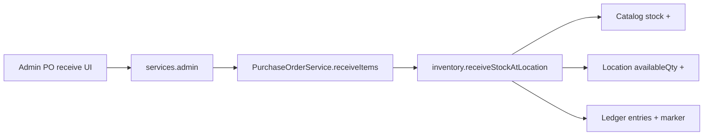

# Commerce Flows

End-to-end stories that cross storefront, admin, and the four frozen protocols. Use this doc when you need the **whole picture**; use [checkout.md](./checkout.md), [inventory.md](./inventory.md), and [refunds.md](./refunds.md) for API-level detail.

Policy anchor: [commerce-protocol-frozen.md](./commerce-protocol-frozen.md)

**Storefront frozen chain:** catalog/PDP (read) → cart (intent buffer) → checkout (commitment gate) → inventory (reservation at checkout) → payment (capture). Proof gate: `npm run test:storefront-release` · browser smoke: `npm run test:e2e:checkout-smoke`. Detail: [storefront-release.md](./storefront-release.md).

---

## Protocol map (one screen)

```txt
                    ┌─────────────────────────────────────┐
                    │         AdminApplicationService      │
                    │  authorize · elevate · operator log  │
                    └───────────┬─────────────┬───────────┘
                                │             │
              requestRefund     │             │ batch adjust / PO receive
                                ▼             ▼
┌──────────────┐         ┌──────────────┐         ┌──────────────┐
│   Checkout   │ reserve │  Inventory   │ deltas  │   Refunds    │
│ money capture│────────▶│ stock move   │◀────────│ money reverse│
└──────┬───────┘ confirm └──────────────┘ restock └──────────────┘
       │
       ▼
   Stripe PI / webhooks
```

---

## Purchase flow (storefront checkout)

**Shopify analogue:** Online Store checkout → Payment → Order created → Inventory committed.

### Happy path

| Step | Actor | Protocol | What happens |
| ---: | --- | --- | --- |
| 1 | Customer | Cart API | `CartService` calls `inventory.checkAvailability` |
| 2 | Customer | Checkout | `POST /api/checkout/create-payment-intent` → `createCheckoutSession` |
| 3 | System | Checkout + Inventory | Lock → `reserveInventory` → pending order → Stripe PaymentIntent |
| 4 | Customer | Stripe.js | Confirms payment |
| 5a | Stripe | Checkout | Webhook `payment_intent.succeeded` → `handleCheckoutWebhook` |
| 5b | Browser | Checkout | `GET /api/checkout/verify` → `recoverPendingOrder` |
| 6 | System | Checkout + Inventory | `confirmReservation` → order status paid/processing |
| 7 | Operator | Admin (read) | Order visible in `/admin/orders` |

Steps 5a and 5b run in parallel in production. Both call the same idempotent finalization — safe if both fire.

### Stock side effect

```text
Before payment:  catalog stock reduced (reservation hold)
After payment:   reservation committed (no second decrement)
On abandon:      releaseReservation restores catalog stock
```

Digital products skip reservation. `continueSellingWhenOutOfStock` skips availability gate.

### Failure branches

| Situation | System response | Operator action |
| --- | --- | --- |
| Payment declined | `payment_failed` webhook → rollback unpaid checkout | Customer retries |
| Customer closes tab mid-checkout | Reservation expires → cleanup job releases stock | None if cleanup runs |
| Stripe paid, local DB lag | Reconciliation case `paid_not_finalized` | Admin → retry recovery |
| Webhook duplicate | Dedup by Stripe event id | None — by design |

Details: [checkout.md § Business flows](./checkout.md#6-business-flows)

---

## Cart flow (pre-checkout)

**Shopify analogue:** Cart → checkout button → checkout.

| Step | Actor | Service | Notes |
| ---: | --- | --- | --- |
| 1 | Customer | `POST /api/cart/items` | Add line |
| 2 | System | `CartService` + `inventory.checkAvailability` | Blocks oversell for physical SKUs |
| 3 | Customer | Apply discount | `POST /api/discounts/validate` |
| 4 | Customer | Navigate to `/checkout` | Checkout page loads Stripe |
| 5 | Customer | Purchase flow below | Cart consumed during session create |

Cart is not locked until checkout session starts — availability is re-validated at checkout. Cart routes call `checkAvailability` only; `reserveInventory` runs exclusively in checkout (`services.checkout`).

---

## Digital product flow

**Shopify analogue:** Digital download / license delivery.

| Step | What happens |
| --- | --- |
| 1 | Product type digital — no inventory reservation |
| 2 | Checkout completes — order paid |
| 3 | Fulfillment may auto-complete or operator marks fulfilled |
| 4 | Customer accesses `/account/vault` | Authenticated asset download |

No `reserveInventory` / `confirmReservation` for digital lines. Vault access enforced server-side on `/api/account/vault`.

---

## Fulfillment flow

**Shopify analogue:** Mark fulfilled → tracking number → customer notification.

| Step | Surface | Service path |
| --- | --- | --- |
| 1 | Admin order detail | `services.admin.fulfillOrder` |
| 2 | Shipping export | `exportOrdersToPirateShipCsv` (read/export) |
| 3 | Tracking import | Admin import tracking API |
| 4 | Customer | `/orders/[id]` shows timeline + tracking URL |

Fulfillment does **not** mutate inventory catalog stock for standard physical ship (stock was committed at payment). Restock-on-cancel/refund uses inventory deltas separately.

---

## Receive stock flow (purchase order)

**Shopify analogue:** Transfer / purchase order receive → inventory increases at location.



| Step | Where | Notes |
| --- | --- | --- |
| 1 | `/admin/purchase-orders/[id]/receive` | Operator enters received quantities |
| 2 | Admin API | Authorized through admin protocol |
| 3 | `receiveStockAtLocation` | **Single** protocol call — fans out catalog + location + ledger |
| 4 | Idempotency | Same key → `{ duplicate: true }`, no double receive |

If location update fails outside a transaction, catalog receive is rolled back via inverse deltas.

Details: [inventory.md § PO receiving](./inventory.md#6-business-flows)

---

## Refund flow

**Shopify analogue:** Admin order → Refund → Stripe credit → optional restock.

### Admin-initiated

```text
Operator clicks Refund (elevated session)
  → POST /api/admin/orders/[id]/refund
  → services.admin.requestRefund(reason, idempotencyKey, elevation check)
  → services.refunds.createRefund({ source: 'admin', ... })
  → RefundService → Stripe refund API
  → order.metadata.stripeRefunds updated
  → operator event logged
```

### Concierge-initiated

```text
Customer chat → LLM emits [PROCESS_REFUND: orderId, amount_cents]
  → validateToolCall + auth + amount cap
  → services.refunds.createRefund({ source: 'concierge', ... })
  → same Stripe path, no admin.requestRefund wrapper
```

### Restock on refund

When refund policy requires returning units to sellable stock, `RefundService` calls `inventory.applyInventoryDeltas` with a reason keyed to the refund — not a separate admin shortcut.

Details: [refunds.md](./refunds.md)

---

## Reconciliation flow (payment mismatch)

**Shopify analogue:** No direct equivalent — this is operational recovery for self-hosted checkout.

When automation detects unsafe state (Stripe says paid, local order says pending/cancelled):

```text
1. Case opened with reason code (paid_not_finalized, mapping_mismatch, …)
2. Operator reviews forensic timeline (admin read routes)
3. Operator action via POST /api/admin/reconciliation/cases
     → services.checkout.handleReconciliationOperatorAction
4. retry_recovery (paid_not_finalized only):
     → idempotent Stripe recovery attempt
     → inventory confirm if needed
     → case resolved
```

Cleanup job (`POST /api/system/cleanup-orders`) scans expired pending orders and may escalate to reconciliation instead of blind cancel.

---

## Inventory correction flow

**Shopify analogue:** Adjust available / set quantity in admin.

| Operator intent | Admin UI | Protocol |
| --- | --- | --- |
| Set absolute on-hand | Inventory batch adjust | `adjustInventory` + idempotency key |
| Fix ledger drift | Reconcile scan | `reconcileInventory` → opens cases |
| Move between locations | Transfers admin | `applyInventoryDeltas` via TransferService |
| Investigate history | Ledger tab | `getProductLedger` (read-only) |

Never set `stock` on product PATCH — rejected by design.

---

## Support + Concierge flow

**Shopify analogue:** Inbox + Sidekick-style assist.

```text
Customer opens Concierge bubble
  → /api/concierge/chat
  → tools: fetch order, KB search, open ticket, processRefund (protocol-bound)
  → session events + audit trail

Operator opens /admin/concierge
  → triage, assign, feedback on AI suggestions
  → links to tickets and orders
```

Destructive Concierge tools pass `validateToolCall` and session policy gates.

Details: [concierge/overview.md](./concierge/overview.md)

---

## System cleanup flows (cron / ops)

| Job | Route | Protocols touched |
| --- | --- | --- |
| Expired pending orders | `POST /api/system/cleanup-orders` | checkout.cleanup + inventory.cleanupExpiredReservations |
| Expired reservations | `POST /api/system/cleanup-inventory` | inventory.cleanupExpiredReservations |

Both return **partial success reports** (HTTP 207 when per-item failures) — jobs do not crash mid-scan.

---

## Flow → document index

| Story | Primary doc | Verification tests |
| --- | --- | --- |
| Storefront lanes (catalog → payment) | [storefront-release.md](./storefront-release.md) | `npm run test:storefront-release` |
| Purchase | [checkout.md](./checkout.md) | `checkout-verification-ladder.test.ts`, `payment-capture-proof.test.ts` |
| Stock hold / commit | [inventory.md](./inventory.md) | `inventory-verification-ladder.test.ts`, `inventory-reservation-proof.test.ts` |
| PO receive | [inventory.md](./inventory.md) | `inventory-location-consistency-ladder.test.ts` |
| Refund | [refunds.md](./refunds.md) | `refund-verification-ladder.test.ts` |
| Admin mutation | [admin.md](./admin.md) | `admin-verification-ladder.test.ts` |
| Full pipeline | [architecture.md](./architecture.md) | `npm run benchmark:order-flow` |

---

## Anti-patterns (do not build these)

| Tempting shortcut | Why it breaks |
| --- | --- |
| Route calls `StripeService.refund` | Bypasses idempotency + event log |
| Product PATCH with `stock: 42` | Bypasses ledger; reconciliation will flag |
| Concierge imports `refundService` | Breaks sealed refund boundary |
| New checkout API that creates PI inline | Duplicate finalization risk |
| PO route calls `applyInventoryDeltas` directly | Skips location fan-out + receive marker |

See [commerce-protocol-frozen.md](./commerce-protocol-frozen.md).
