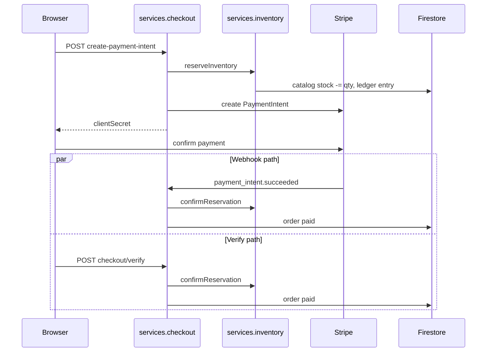

# Onboarding

This guide gets you from **zero to a working local store** — storefront, admin, checkout, and stock — in a predictable order. Use it alongside [getting-started.md](./getting-started.md) for env var detail and [architecture.md](./architecture.md) for how the pieces connect.

---

## Who this is for

| Persona | Goal | Path |
| --- | --- | --- |
| **Developer** | Run, test, and extend the platform | [Day 0 developer checklist](#day-0-developer-checklist) → [First code change](#where-to-make-your-first-change) |
| **Merchant operator** | Use admin like Shopify Admin | [Day 0 operator checklist](#day-0-operator-checklist) → [admin.md](./admin.md) |
| **Architect / reviewer** | Understand mutation boundaries | [architecture.md](./architecture.md) → [commerce-protocol-frozen.md](./commerce-protocol-frozen.md) |

---

## Day 0 developer checklist

Work through these in order. Each step builds on the previous one.

### 1. Clone and bootstrap (~5 min)

```bash
git clone <your-fork-url>
cd DreamBeesArt
npm run setup
```

`npm run setup` (`scripts/setup.sh`):

1. Verifies Node ≥ 20 (22 recommended per `package.json`)
2. Creates `.env` from `.env.example` with a fresh `SESSION_SECRET`
3. Runs `npm install`
4. Seeds Firestore via `SeedDataLoader.ts` (sample products, admin user, catalog stock through inventory-safe paths)

### 2. Configure Firebase (~15 min)

You need a Firebase project before `npm run dev` can persist data.

1. [Firebase Console](https://console.firebase.google.com/) → Create project
2. Enable **Authentication** → Email/Password (and Google if you use it)
3. Create **Firestore** database (production mode; apply rules from your deploy workflow)
4. Project settings → Web app → copy `NEXT_PUBLIC_FIREBASE_*` into `.env`
5. Service accounts → Generate key → set `FIREBASE_SERVICE_ACCOUNT_JSON` (JSON string in `.env` or secure secret store)

Restart the dev server after changing `.env`.

### 3. Configure Stripe (~10 min)

1. [Stripe Dashboard](https://dashboard.stripe.com/) → Developers → API keys → **Test mode**
2. Copy publishable + secret keys into `.env`
3. Start webhook forwarding (separate terminal):

```bash
stripe listen --forward-to localhost:3000/api/webhooks/stripe
```

4. Copy the `whsec_…` signing secret → `STRIPE_WEBHOOK_SECRET` in `.env`
5. Restart `npm run dev`

Without step 3–4, payments may succeed in Stripe UI but orders can stay **pending** locally.

### 4. Start the app

```bash
npm run dev
```

Open `http://localhost:3000`.

### 5. Prove commerce works (~10 min)

**Storefront smoke test**

1. Browse `/collections/bestsellers` — seeded catalog should load (`/products` redirects there)
2. Add a physical product to cart → `/cart` → `/checkout`
3. Pay with Stripe test card `4242 4242 4242 4242`
4. Land on success / verify path → order appears in `/orders`

**Admin smoke test**

1. Sign in at `/login` (see [Default dev credentials](#default-dev-credentials))
2. Open `/admin/orders` — confirm the test order exists
3. Open `/admin/inventory` — stock moved through reservation/commit (not raw PATCH)

**Automated smoke tests**

```bash
npm run test:storefront-release
npm run test:e2e:cart-smoke
npm run test:e2e:checkout-smoke
```

### 6. You are ready when

- [ ] `npm run dev` serves storefront and admin without Firebase/Stripe console errors
- [ ] Test checkout creates a **paid** order (not stuck pending)
- [ ] `npm test` and `npm run test:storefront-release` pass locally
- [ ] The relevant isolated browser gate passes: cart smoke for cart changes, checkout smoke for checkout changes
- [ ] You know which doc to open for checkout vs inventory vs refunds ([flows.md](./flows.md))

**Next:** [day-2.md](./day-2.md) — rebrand, first product, trace a request, production prep.

---

## Mental model (60 seconds)

DreamBees Art is one Next.js app with **four locked doors** for dangerous operations:

```text
Shopper/UI  →  API routes  →  [ checkout | inventory | refunds | admin ]  →  Firestore + Stripe
                                    ↑ only these may mutate money/stock
```

Cart intent uses `services.cart`; other reads use their query services. The moment money or catalog stock moves, execution must be inside a frozen mutation protocol.

Visual: [architecture.md § System context](./architecture.md#system-context)

---

## Day 0 operator checklist

For non-developers evaluating the merchant console:

1. **Log in** — `/login` with dev admin credentials (rotate in production)
2. **Home** — `/admin` — setup progress and today’s priorities
3. **Products** — `/admin/products` — catalog, variants, metafields
4. **Inventory** — `/admin/inventory` — on-hand counts; adjustments go through batch API, not inline product edit
5. **Orders** — `/admin/orders` — fulfill, note, refund (refund requires reason + elevation)
6. **Customers** — `/admin/customers` — profiles and order history
7. **Settings** — `/admin/settings` — store name, SEO, shipping

Operator workflows: [admin.md](./admin.md) · End-to-end stories: [flows.md](./flows.md)

---

## Default dev credentials

After `npm run setup` seeds the database:

| Field | Value |
| --- | --- |
| Email | `admin@woodbine.com` |
| Password | `admin-password-123` |
| Role | `admin` |

**Local development only.** Create production admins through Firebase Auth + Firestore `users` role documents; never ship default passwords.

More: [.wiki/admin-access.md](../.wiki/admin-access.md)

---

## First purchase walkthrough (what actually happens)

When you complete a test checkout, four protocols cooperate:



Both finalization paths are **idempotent** — duplicate webhook + verify must not double-charge or double-commit stock.

Deep dive: [flows.md § Purchase flow](./flows.md#purchase-flow-storefront-checkout)

---

## Environment quick reference

| If you skip… | What breaks |
| --- | --- |
| `FIREBASE_SERVICE_ACCOUNT_JSON` | Server routes 500; no orders persisted |
| Stripe keys | Checkout 503 `STRIPE_NOT_CONFIGURED` |
| Webhook secret + `stripe listen` | Payment succeeds in Stripe; order stays pending |
| `SESSION_SECRET` | Sessions invalid; login loops |
| Seed | Empty catalog; no admin user |

Full variable list: [getting-started.md § Environment](./getting-started.md#environment-variables)

---

## Common first-week tasks

| Task | Where to look |
| --- | --- |
| Rebrand the store | Admin Settings, `src/domain/seo/brand.ts`, `public/images/` |
| Add a product | `/admin/products/new` |
| Receive stock from a supplier | `/admin/purchase-orders` → receive flow |
| Issue a refund | `/admin/orders/[id]` → refund (reason required) |
| Debug stuck pending order | [checkout.md § Reconciliation](./checkout.md#6-business-flows) |
| Fix stock mismatch | `/admin/inventory` → reconcile → [inventory.md § Reconcile](./inventory.md) |
| Customize storefront UI | `src/ui/pages/`, [storefront.md](./storefront.md) |
| Add API behavior | Find route in `src/app/api/` → delegate to `services.*` only |

---

## Where to make your first change

Follow the **frozen protocol rule**: new commerce mutations enter through application services, not routes calling Stripe or `batchUpdateStock` directly.

| Change type | Start here | Do not |
| --- | --- | --- |
| Checkout behavior | `src/core/order/CheckoutFlowService.ts` + flow modules | Call `StripeService` from routes |
| Stock behavior | `src/core/inventory/InventoryFlowService.ts` | Call `productRepo.batchUpdateStock` from routes |
| Refund behavior | `src/core/refund/RefundFlowService.ts` | Call `RefundService` from routes/tools |
| Admin authorization | `src/core/admin/AdminFlowService.ts` | Bypass elevation/reason on refunds |
| Storefront UI | `src/ui/` | Import Firestore in components |
| New API route | `src/app/api/…` | Embed payment or stock logic inline |

After any protocol change, update the matching verification ladder test.

---

## Learning path (recommended reading order)

```text
1. platform-overview.md       What this is vs Shopify
2. onboarding.md              Day 0 setup
3. day-2.md                   Rebrand, trace, production prep
4. local-development.md       Daily dev workflow
5. architecture.md            Layers + protocols
6. protocols.md               All four protocols unified
7. flows.md                   End-to-end stories
8. glossary.md                Terms when reading code
9. checkout.md / inventory.md / refunds.md
10. contributing-commerce.md  Before your first commerce PR
11. commerce-protocol-frozen.md
12. troubleshooting.md        When something breaks
13. deployment.md + runbook.md + release-checklist.md
14. customization.md          Rebrand / fork
15. faq.md                    Quick answers
```

---

## Troubleshooting (first hour)

| Symptom | Likely cause | Fix |
| --- | --- | --- |
| Empty product list | Seed failed or wrong Firebase project | Re-run `npm run setup`; check Firestore project id in `.env` |
| Checkout infinite spinner | Missing Stripe publishable key | `NEXT_PUBLIC_STRIPE_PUBLISHABLE_KEY` + restart |
| Order pending forever | Webhook not reaching app | `stripe listen` + correct `STRIPE_WEBHOOK_SECRET` |
| Admin 403 | Not admin role | Sign in as seeded admin; check `users` collection |
| Inventory adjust 400 | PATCH product stock | Use `/admin/inventory` batch adjust |
| Refund 403 | Not elevated | Admin session with elevation + reason |

Extended: [.wiki/onboarding/troubleshooting.md](../.wiki/onboarding/troubleshooting.md)

---

## Next steps

- [local-development.md](./local-development.md) — daily dev workflow
- [getting-started.md](./getting-started.md) — env reference, deploy
- [flows.md](./flows.md) — purchase, receive, refund stories
- [architecture.md](./architecture.md) — system design
- [index.md](./index.md) — full documentation hub
