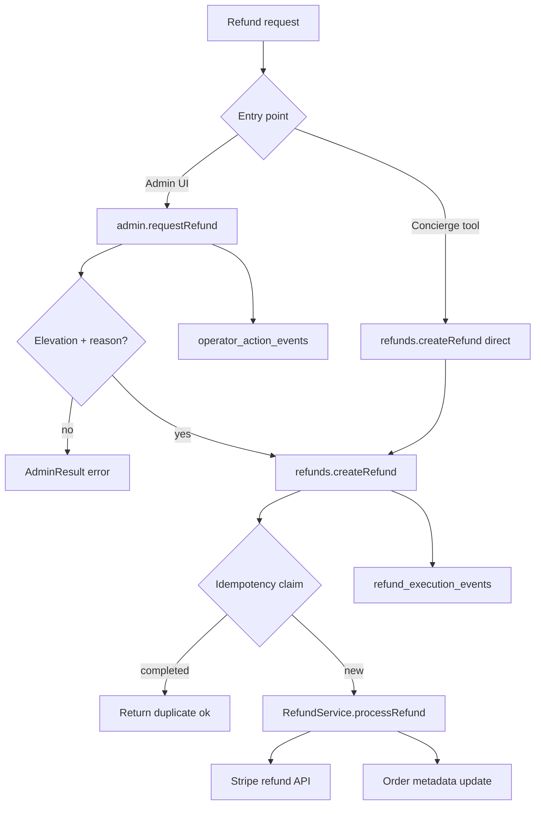

# Refunds

> **Refunds are money reversal — not an admin shortcut around Stripe.**

DreamBees Art routes every refund through `RefundApplicationService`. Admin buttons, Concierge tools, and future automations call `services.refunds.createRefund()` — never `RefundService.processRefund()` directly.

Policy: [commerce-protocol-frozen.md](./commerce-protocol-frozen.md) · Stories: [flows.md § Refund flow](./flows.md#refund-flow)

---

## Reading guide

| You want to… | Jump to |
| --- | --- |
| Trace admin refund click | [Admin-initiated flow](#admin-initiated-refund) |
| Trace Concierge refund | [Concierge-initiated flow](#concierge-initiated-refund) |
| Understand idempotency | [Idempotency](#idempotency) |
| Look up API fields | [Public API](#public-api) |
| Run seal tests | [Verification](#verification) |

---

## Shopify analogue

| Shopify concept | DreamBees Art implementation |
| --- | --- |
| Refund in admin | `services.admin.requestRefund` → `services.refunds.createRefund` |
| Partial refund | `amount` in cents on `createRefund` |
| Restock on refund | `RefundService` → `inventory.applyInventoryDeltas` (when policy requires) |
| Refund idempotency | `refund_execution_claims` + order `processedRefundKeys` |

---

## Refund lifecycle



---

## Admin-initiated refund

```text
Operator (elevated) → POST /api/admin/orders/[id]/refund
  Input: amount, reason, idempotencyKey

  services.admin.requestRefund
    ✓ actor.elevated
    ✓ reason non-empty
    ✓ claim admin operator event

  services.refunds.createRefund({ source: 'admin', ... })
    ✓ claim refund_execution
    ✓ RefundService → Stripe
    ✓ recordExecution in event log

  operator event marked completed
```

UI must send a **stable idempotency key** per refund intent (e.g. client UUID). Retries with the same key must not double-refund.

---

## Concierge-initiated refund

```text
Chat → [PROCESS_REFUND: "orderId", amount_cents]
  ✓ customer authenticated
  ✓ amount ≤ MAX_CONCIERGE_REFUND_CENTS
  ✓ validateToolCall('processRefund', ...)

  services.refunds.createRefund({
    source: 'concierge',
    actor: { id: 'concierge', email: '...' },
    reason: 'Concierge autonomous refund for session …',
    idempotencyKey: 'concierge-refund-{session}-{order}-{amount}',
  })
```

Concierge skips `admin.requestRefund` but still hits the same refund protocol and Stripe path. Event log records `source: 'concierge'`.

Details: [concierge/overview.md](./concierge/overview.md)

---

## Protocol shape

```text
HTTP route / Concierge tool / Admin action
  → services.refunds.createRefund()     (RefundApplicationService)
  → RefundResult<T>
  → refundRouteAdapter (admin routes) or inline result handling (Concierge)
  → RefundService.processRefund()       (internal only)
  → StripeRefundProcessor.refundPayment()
  → FirestoreRefundEventLog             (idempotency + audit)
```

---

## Public API

**Interface:** `RefundApplicationService` (`src/core/refund/refundApplicationService.ts`)  
**Implementation:** `RefundFlowService` (`src/core/refund/RefundFlowService.ts`)  
**Container export:** `services.refunds`

### `createRefund`

| Field | Required | Notes |
| --- | --- | --- |
| `orderId` | yes | Target order |
| `amount` | yes | Positive integer cents |
| `idempotencyKey` | yes | Dedup across retries |
| `reason` | yes | Operator or derived Concierge reason |
| `actor` | yes | `{ id, email }` — admin user or system actor |
| `source` | optional | `'admin' \| 'concierge' \| 'system'` — stored in event log |

**Success data:** `{ orderId, amount, status, stripeRefundId?, idempotencyKey }`  
**Result:** `RefundResult<T>` — failures are typed, not thrown.

### `getRefundStatus`

Read model: refunded amount, refundable balance, processed keys, Stripe refund entries.

---

## Idempotency

| Store | Collection | Purpose |
| --- | --- | --- |
| Claims | `refund_execution_claims` | In-flight / completed dedup |
| Events | `refund_execution_events` | Audit record per successful execution |

Duplicate `createRefund` with the same key returns `{ ok: true, duplicate: true }` without a second Stripe refund.

Order metadata also tracks `processedRefundKeys` and `metadata.stripeRefunds` for forensic reads.

---

## Admin authorization

`AdminFlowService.requestRefund` requires:

- Elevated admin actor
- Non-empty `reason`
- `idempotencyKey`
- Operator event recorded on success

Routes:

| Route | Method |
| --- | --- |
| `/api/admin/orders/[id]/refund` | POST |
| `/api/admin/orders/[id]` | PATCH (refund status path) |

Both use `services.admin.requestRefund` — no `refundService` import.

---

## Concierge limits

| Guard | Behavior |
| --- | --- |
| Customer auth | Refunds require logged-in customer |
| Amount cap | `MAX_CONCIERGE_REFUND_CENTS` — escalate above |
| Tool validation | `validateToolCall('processRefund', ...)` |
| Protocol validation | actor, reason, idempotencyKey enforced in `RefundFlowService` |

---

## Internal modules (do not import from routes)

| Module | Role |
| --- | --- |
| `RefundService` | Stripe + order metadata updates |
| `RefundFlowService` | Public orchestration |
| `createRefundStack()` | Factory |
| `FirestoreRefundEventLog` | Claims and events |
| `refundRouteAdapter.ts` | HTTP mapping for admin refund routes |

---

## Verification

```bash
npm test -- --run src/tests/refund-verification-ladder.test.ts
```

| Invariant | Proof |
| --- | --- |
| Idempotency key required | Validation test |
| Actor required | Validation test |
| Reason required | Validation test |
| Duplicate key no double refund | processRefund called once |
| Event log records execution | In-memory event log assertion |
| Concierge source tagged | Event `source: 'concierge'` |
| Admin routes sealed | No `refundService` in route files |
| Concierge route sealed | Uses `refunds.createRefund` |

---

## Frozen policy

- **One public API:** `RefundApplicationService` via `services.refunds`
- **One result type:** `RefundResult<T>`
- **One construction path:** `createRefundStack()`
- **No direct `RefundService` from routes, tools, or admin handlers**
- **Admin always passes through `requestRefund` for operator authorization**

Extend behavior inside `RefundFlowService` and `RefundService`. Do not add parallel refund entry points.

---

## Key files

```
src/core/refund/
  refundApplicationService.ts
  refundResult.ts
  RefundFlowService.ts
  createRefundStack.ts
  refundEventLog.ts

src/core/RefundService.ts
src/infrastructure/refund/FirestoreRefundEventLog.ts
src/infrastructure/server/refundRouteAdapter.ts
src/app/api/admin/orders/[id]/refund/route.ts
src/app/api/concierge/chat/route.ts
```
