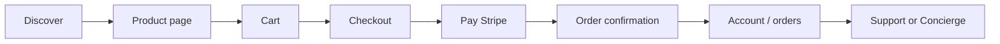

# Storefront

The DreamBees Art **customer-facing shop** covers discovery, cart, checkout, account, support, and content — the same jobs Shopify’s Online Store channel handles. All pages live under `src/app/` with UI in `src/ui/`.

**First test purchase:** [onboarding.md § First purchase walkthrough](./onboarding.md#first-purchase-walkthrough-what-actually-happens) · **Checkout internals:** [checkout.md](./checkout.md) · **Full flow:** [flows.md § Purchase](./flows.md#purchase-flow-storefront-checkout)

---

## Customer journey



| Stage | Routes | Backend |
| --- | --- | --- |
| Discover | `/`, `/products`, `/collections/*`, `/search` | Product/collection APIs |
| Evaluate | `/products/[handle]` | Reviews, metafields, availability read |
| Cart | `/cart` | `CartService` + inventory availability check |
| Checkout | `/checkout` | `services.checkout` only for payment |
| Post-purchase | `/orders`, `/account/vault` | Order query, digital vault |
| Help | `/support`, Concierge bubble | Tickets, KB, AI tools |

---

## Page map

| Route | Purpose |
| --- | --- |
| `/` | Home, featured collections, editorial content |
| `/products` | Product listing and filters |
| `/products/[handle]` | Product detail (variants, metafields, reviews) |
| `/collections/[slug]` | Collection landing |
| `/collections/[slug]/products/[handle]` | Collection-scoped product URL |
| `/search` | Search results |
| `/cart` | Cart review and note |
| `/checkout` | Stripe PaymentIntent checkout |
| `/account` | Profile and preferences |
| `/orders`, `/orders/[id]` | Order history and detail |
| `/wishlist` | Saved products |
| `/support` | Help center, categories, articles |
| `/support/articles/[slug]` | KB article |
| `/blog`, `/blog/[slug]` | Content marketing |
| `/account/vault` | Digital goods locker |

---

## Shopping flow

```text
Browse → Add to cart → Checkout → Pay (Stripe) → Verify / webhook → Order confirmation
```

### Cart API

| Endpoint | Method | Role |
| --- | --- | --- |
| `/api/cart` | GET, POST | Load or create cart |
| `/api/cart/items` | POST, PATCH, DELETE | Line items |
| `/api/cart/note` | POST | Order note |

`CartService` checks inventory availability via `services.inventory.checkAvailability` before adding physical SKUs.

### Checkout API

Checkout mutations go **only** through `services.checkout`:

| Endpoint | Method | Checkout method |
| --- | --- | --- |
| `/api/checkout/create-payment-intent` | POST | `createCheckoutSession` |
| `/api/checkout/verify` | GET | `recoverPendingOrder` |
| `/api/webhooks/stripe` | POST | `handleCheckoutWebhook` |
| `/api/orders` | POST | `completeCheckoutWithPaymentMethod` |

See [checkout.md](./checkout.md) for protocol details.

### Discounts

| Endpoint | Role |
| --- | --- |
| `/api/discounts/validate` | Apply code at cart/checkout |

---

## Account and orders

Authenticated customers use Firebase-backed sessions (HTTP-only cookie).

| Endpoint | Role |
| --- | --- |
| `/api/auth/sign-in`, `sign-up`, `sign-out` | Session lifecycle |
| `/api/auth/forgot-password` | Password reset email |
| `/api/orders` | List orders |
| `/api/account/vault` | Digital asset access |

Order pages show timeline events, tracking links when present, and fulfillment status — patterns familiar from Shopify customer accounts.

---

## Authentication flows

### Guest shopper

```text
Browse → add to cart → checkout as guest OR register mid-flow
  → Firebase Auth (email/password or Google if enabled)
  → signed HTTP-only session cookie
  → cart merged to user id
```

Routes: `/register`, `/login`, `/api/auth/sign-up`, `/api/auth/sign-in`

### Returning customer

Session persists across visits (cookie). Account at `/account` — profile, orders, vault, wishlist.

### Password reset

`/forgot-password` → `POST /api/auth/forgot-password` → Brevo email (when configured)

### Step-up (high-value checkout)

Some checkout paths require recent re-auth (`requireStepUpSessionUser`) — mirrors Shopify high-value order verification pattern.

---

## Checkout client behavior

The checkout page (`/checkout`) typically:

1. Loads cart from `/api/cart`
2. Validates discount via `/api/discounts/validate` if code applied
3. Calls `POST /api/checkout/create-payment-intent` with **idempotency key** (stable per checkout attempt)
4. Initializes Stripe.js with `clientSecret`
5. On payment success → redirect to success URL
6. Success page calls `GET /api/checkout/verify?payment_intent=…` in parallel with webhook finalization

**Client must not** finalize orders locally — always wait for verify response or poll `/api/orders`.

Stripe test cards: [local-development.md](./local-development.md)

---

## Error states (customer-facing)

| Situation | Typical UX | Backend |
| --- | --- | --- |
| Out of stock | Add-to-cart error | `checkAvailability` |
| Payment declined | Stripe error message | `payment_failed` webhook → rollback |
| Session expired | Re-login prompt | 401 on API |
| Checkout already in progress | Error or resume | Checkout lock |
| Verify slow | Loading / retry | Webhook may still finalize |

Operator/debug: [troubleshooting.md](./troubleshooting.md)

---

- **Handle-based URLs** — `/products/[handle]` (stable, shareable)
- **JSON-LD** and meta tags from product/collection SEO fields
- **Local business schema** from `NEXT_PUBLIC_BUSINESS_*` env vars
- Admin SEO tools mirror Yoast-style guidance (focus keyphrase, preview snippets)

Configuration: admin Settings → SEO, `src/domain/seo/`.

---

## Support center

Public support surface (no admin role required):

| Route / API | Role |
| --- | --- |
| `/support` | Categories and search |
| `/api/support/categories` | Category tree |
| `/api/support/articles/[slug]` | Article content |
| `/api/tickets` | Customer ticket creation |
| `/api/tickets/[id]/messages` | Thread replies |

Macros and agent tools are admin-only.

---

## Concierge (customer chat)

The **Concierge bubble** (`src/ui/components/Concierge/`) provides AI-assisted support on the storefront:

- Session persistence and reconnection
- Order lookup, KB search, ticket open/close
- Autonomous resolutions within policy limits (refunds via `services.refunds`, not raw `RefundService`)

Details: [concierge/overview.md](./concierge/overview.md)

---

## Wishlist and discovery

| Feature | API / storage |
| --- | --- |
| Wishlist | `/api/wishlists`, `/api/wishlists/[id]/items` |
| Recently viewed | Client localStorage + hooks |
| Navigation menu | `/api/navigation` (admin-editable) |
| Collections | `/api/collections/[handle]` |

---

## UI architecture

```
src/ui/pages/          # Page-level compositions
src/ui/components/     # Reusable storefront components
src/ui/hooks/          # Cart, wishlist, session hooks
src/ui/apiClientServices.ts   # Typed fetch facade
```

Storefront components do **not** import Firestore or Stripe SDKs directly — all server state flows through API routes.

---

## Customization

Unlike Shopify themes, customization is **source-level**:

1. **Branding** — `src/domain/seo/brand.ts`, `public/images/`, admin Settings
2. **Layout** — `src/ui/layouts/`, home page sections in `src/ui/pages/home/`
3. **Product card / detail** — `src/ui/pages/product-detail/`
4. **Checkout UI** — `src/ui/components/checkout/`

There is no Liquid layer; merchants fork the repo or maintain a private branch for visual changes.

---

## Related docs

- [checkout.md](./checkout.md) — payment protocol
- [inventory.md](./inventory.md) — stock reservations at checkout
- [platform-overview.md](./platform-overview.md) — full feature comparison
